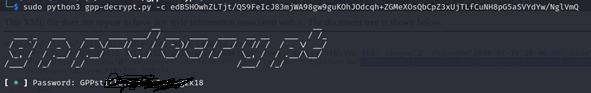

# Active – 10.10.10.100

To begin with, a Nmap scan will be issued to obtain all the open TCP ports on the target. Following command is used ``` sudo nmap -sS -p- --min-rate 1000 -oN activePortScan active.htb ```
 


## 4.1.1 Service Enumeration

Once the open ports are known, the services enumeration process begins. In order to do this, Nmap tool is used and, specifically the following command: ``` sudo nmap -sS -sV -O -sC -p53,88,135,139,389,445,464,593,636,3268,3269,5722,9389,47001 -oN activeServiceVer-sionScan active.htb ```
 


### SMB Enumeration

SMB enumeration was made using enum4linux initially with the following command: ``` enum4linux -a 10.10.10.100 ```


As seen in the previous picture, null sessions are possible and it was possible to list all the shares and which permissions do I have (as an anonymous user) over them.

As I only have listing permissions over Replication share, this will be the next step to continue enumerating SMB.

I will now spider the Replication share using as pattern “.”. As shown on the next picture, plenty of files were found.
 


To easily search through the files, I download all of them using following “SMBCLIENT” commands:

```
smbclient //10.10.10.100 /Replication
mask ""
recurse
prompt
mget *
```


Inspecting the recently downloaded files, *Group.xml* is found.

As it can be read [here](https://adsecurity.org/?p=2288), *Groups.xml* contains the AES encrypted password for certain users (SVC_TGS in this case). The tricky point is that the AES key used by Microsoft to encrypt the password, was made public (unknown reason) and now it is possible to obtain the cleartext credentials.


## 4.1.2 Initial Access – Group Policy Preference Cached Password.

Vulnerability Explanation: before KB 2928120 some Group Policy Preferences could be configured with a custom account. The initial intention for this was to deploy a custom Local Administrator account on some hosts of the domain. As Group Policy Objects are stored as XML files, it is possible to read them. Moreover, there is a value named ‘cpassword’ where the AES256 encrypted password for the custom account is encrypted with a publicly docu-mented default key. As a result, any user on the domain can access and obtain the pass-word for the user.

Vulnerability Fix: install KB2962486.

Severity: Critical

Steps to reproduce the attack: 

- Once Groups.xml is found and retrieved, open it and get the value of ‘cname’ field.

- Using Gpp-Decrypt (obtained from here) extract cleartext password.
 


- Password for user SVC_TGS is *GPPsti[....]g2k18*

- After this, it is possible to access SMB as user SVC_TGS and get the user.txt file.
 


Content of user.txt is:
 


### 4.1.3 Post-Exploitation

After accessing user.txt, all users are listed using ```crackmapexec smb 10.10.10.100 -u SVC_TGS -p ‘GPPstillStandingStrong2k18’ –users ```
 


Seeing this short user-list, next step is to continue with Kerberos.

### 4.1.4 Privilege Escalation – Kerberoast

Vulnerability Explanation: once domain credentials have been retrieved, it is possible to try and recollect TGS for all the services that are running on behalf of user accounts in the AD. TGS are somewhat encrypted with keys that are derived from the user password. If it is pos-sible to retrieve any of these tickets, there will be a chance to crack them offline and obtain the user password.

Vulnerability Fix: use stronger passwords.

Severity: Critical

Steps to reproduce the attack:

- First step is to retrieve TGS, for this Impacket-GetUserSPNs will be used. Command is “impacket-GetUserSPNs active.htb/SVC_TGS:GPPstillStandingStrong2k18 -outputfile hashesKerbeRoastActive”.
 


- As seen in the picture, a TGS for user Administrator is retrieved.

-	Content of the hasheKerbeRoastActive is:
 


- To crack the TGS and obtain the password, hascat will be used. Command is “.\hashcat -m 13100 --force -a 0 hashesKerbeRoastActive rockyou.txt”
 


- Administrator password is recovered: *Ticke[...]1968*

- Now it is possible to execute commands on the DC.
 


Screenshot:
 

