# Agile Machine

## Service Enumeration

To begin with, I start scanning all the ports on the target to obtain an overall picture of the target. For this I use following command ```sudo nmap -sS -p- --min-rate 10000 -v agile.htb```

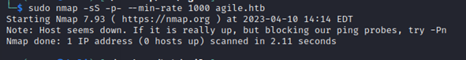

New scan is made adding the -Pn flag to treat the host as if it was up ```sudo nmap -Pn -p- --min-rate 10000 agile.htb```

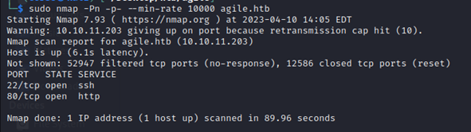

Once the open ports are known, I began the service enumeration process. To do this the follow-ing command was used ```sudo nmap -sS p22,80 -sV -O agile.htb```

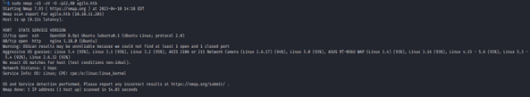

### Port Scan Results

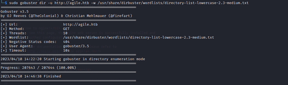

### HTTP Enumeration

The first step taken was to scan using gobuster in order to find directories and other functions in the service. The command used was ```sudo gobuster dir -u http://agile.htb -w /usr/share/dirbuster/wordlists/directory-list-lowercase-2.3-medium.txt```

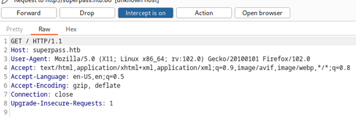

The fact that 0 results were found with the previous scan is quite unique. Just to check, I try to visit the webpage without specifying any domain, just using the IP address (and Burpsuite). As expected, the specified domain was not correct.

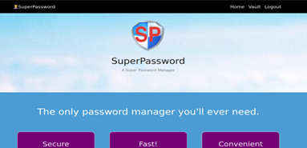

With this in mind, I re-run the directory scan ```sudo gobuster dir -u http://superpass.htb -w /usr/share/dirbuster/wordlists/directory-list-lowercase-2.3-medium.txt -x conf,txt,php -t 50```

To gain a deeper knowledge of the web logic, I start to manually interact with the webpage using burpsuite to inspect the HTTP requests. As shown in the picture below, it appears to be a password manager. 

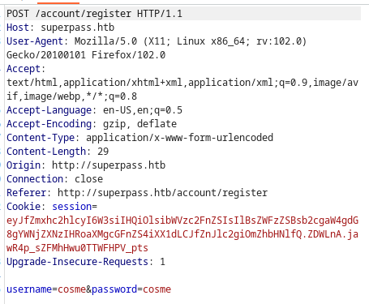

In “/account/register” It allows to register new users, so I register myself as “cosme:cosme”.

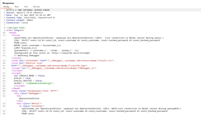

As a result, the server HTTP response code is 500 indicating that some error occurred.

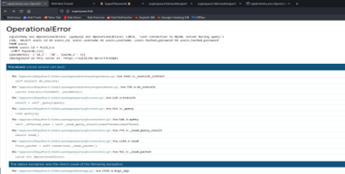

As it can be seen in the image below, the server throws an “SQL Operational Error” and shows the debugger’s traceback of the error.

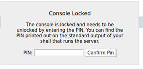

The fact that the Debugger mode is active is very interesting because it can lead to code execution as it allows to open a python interactive console. This console can be protected by a PIN, however, if we can access some specific files in the server through LFI, we could potentially generate a PIN and open the interactive python console.

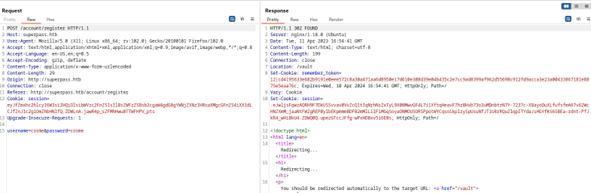

The console is indeed protected by a PIN. The registering error does not happen always and so, I can register and login to keep checking the web functionalities.

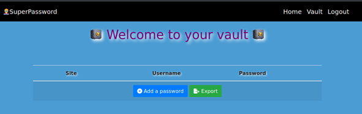

Once logged in, I am redirected to “/vault”, where I can add new passwords, and (what is more interesting) exporting the ones that I have previously added.

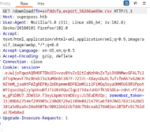

After adding some passwords, I export everything and among all the generated HTTP requests it points out the one where I download the CSV file.

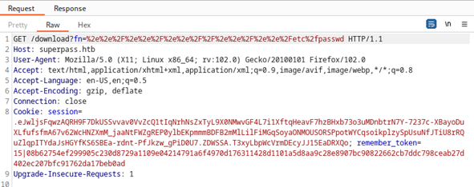


Using a LFI dictionary obtained online (“https://github.com/carlospolop/Auto_Wordlists/blob/main/wordlists/file_inclusion_linux.txt”) I automate the search, getting a positive result and thus, finding a LFI vulnerability.

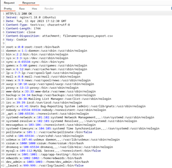

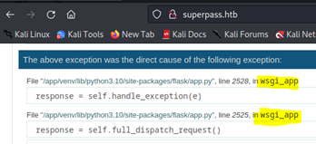

## Initial Access - Werkzeug Debug Console Pin Bypass

**Vulnerability Explanation**: Werkzeug debug console requires a PIN by default. If a LFI vulner-ability is found (LFI explained in Service Enumeration), it is possible to obtain the necessary information about the system and generate a valid PIN to open a python interactive console on the server.

**Vulnerability Fix**: Disable debugger in production.

**Severity**: Critical

**Steps to reproduce the attack**: steps followed for generating a valid PIN were those described in “https://book.hacktricks.xyz/network-services-pentesting/pentesting-web/werkzeug” and the python code used was found in “https://github.com/wdahlenburg/werkzeug-debug-console-bypass/blob/main/werkzeug-pin-bypass.py”. 

Following information is needed to generate the PIN:

•	username of the user who started this Flask, in this case is ```www-data```

•	modname, in this case is ```flask.app```

•	```getattr(app, '__name__', getattr (app .__ class__, '__name__'))``` in this case is ```wsgi_app```

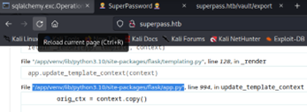

•	```getattr(mod, '__file__', None)``` is the absolute path of app.py in the flask directory, in this case is ```/app/venv/lib/python3.10/site-packages/flask/app.py```

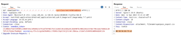

•	MAC address of the server (found in /sys/class/net/eth0/address), in this case is ```00:50:56:b9:75:e3```

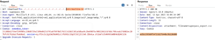

•	Machine Id, which is the result of concatenating ```/etc/machine-id``` and the first line of ```/proc/self/cgroup``` after the last slash.

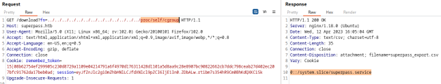

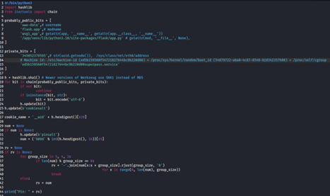

After gathering all the information and adding it to the script, the code to generate the PIN is the following.

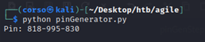

Once run, it generates a valid PIN.

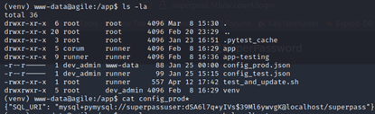

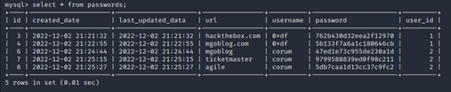

After opening the interactive python console, a reverse connection is established and a shell is opened as ```www-data```
Once inside the shell, an interesting file is found ```/app/config_prod.json``` that contains valid MySQL credentials ```superpassuser:dSA6l7q*yIVs$39Ml6ywvgK```

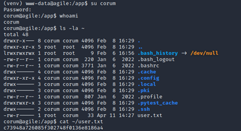

Using those credentials, it is possible to access MySQL database where the vaults of other users of the “Superpass Password Manager” are stored. One of the vaults belongs to user “corum” and contains his credentials for “agile” ```corum: 5db7caa1d13cc37c9fc2```

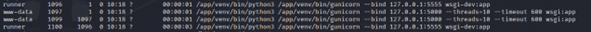

It is possible to authenticate as user “corum” and open a new shell, accessing “user.txt”.

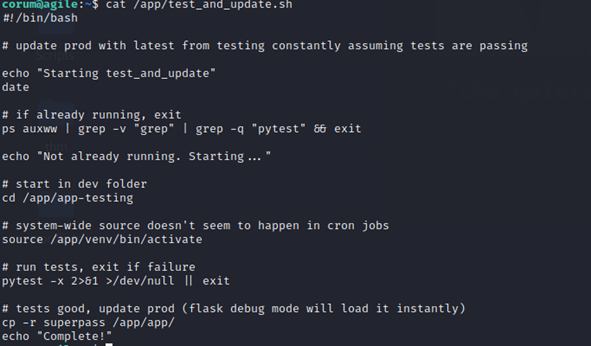

Once identified as “corum”, inspecting the output of ```ps -ef``` it is found that there are two instances of the application running simultaneously: “wsgi-dev” and “wsgi”.

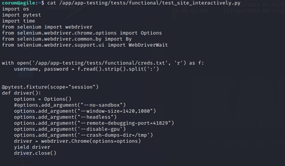

What it is occurring on the server is a constant testing of “wsgi-dev” app (located in ```/app/app-testing/wsgi-dev.py```) in order to update “wsgi” app (located in ```/app/app/wsgi.py```). This can be checked inspecting ```/app/test_and_update.sh```

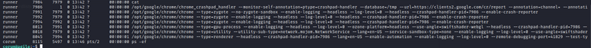

Checking the available test file found in ```/app/app-testing/tests/functional/test_site_interactively.py``` and current running processes it is found that Chrome is running to debug interactively the app using the remote debug-ging port “41829”. 

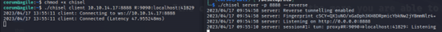

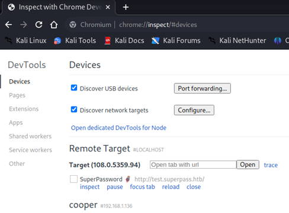

With this information, chisel is used to establish a tunnel and to interact with the Debugging Instance (running on the target) in my local Chromium browser. For this, a Basic Server Listener is started in my machine on port 8888 (accepting reverse tunnels) which is connected from the target and then a tunnel pointing to the remote debugging port (41829) is established.

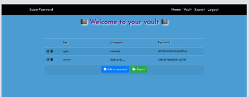

After this, the debugging instance can be accessed using “Chromium”.

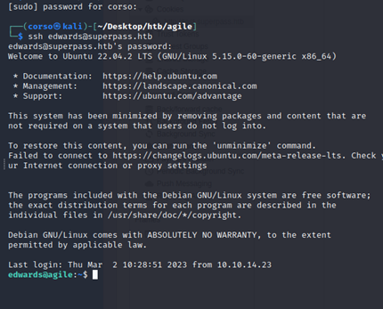

Once here, valid credentials for user “Edwards” ```edwards:d07867c6267dcb5df0af``` are found as his Vault is opened in the Debugging Instance.


It is possible to access the target machine vía SSH using those credentials.


## Privilege Escalation - Sudoedit

**Vulnerability Explanation**: In Sudo before 1.9.12p2, the sudoedit (aka -e) feature mishandles extra arguments passed in the user-provided environment variables (SUDO_EDITOR, VISUAL, and EDITOR), allowing a local attacker to append arbitrary entries to the list of files to process. This can lead to privilege escalation. Affected versions are 1.8.0 through 1.9.12.p1. The problem exists because a user-specified editor may contain a "--" argument that defeats a protection mechanism, e.g., an EDITOR='vim -- /path/to/extra/file' value (https://nvd.nist.gov/vuln/detail/CVE-2023-22809). 


As it can be seen in the following picture (Illustration 35), user Edwards is able to execute sudoedit as user “dev_admin” to modify two specific files. However, due to **CVE-2023-22809**, it is possible to modify any file as user dev_admin (“https://www.synacktiv.com/sites/default/files/2023-01/sudo-CVE-2023-22809.pdf”).
 


**Vulnerability Fix**: Update Sudo Version to the latest Stable Release 1.9.13p3 (https://www.sudo.ws/).

**Severity**: Critical/Medium

**Steps to reproduce the attack**:

Inspecting the running processes, it is possible to observe that there is a cron job that runs ```/bin/bash -c source /app/venv/bin/activate``` regularly as “root”. Checking the file permissions, Group owner is dev_admin.


Taking all the previous information into account, we can modify the file ```/app/venv/bin/activate``` as user dev_admin and then wait until the cron job executes the file with root privileges. Steps as follows:

1.	Set the environment variable EDITOR adding the extra file to modify.


2.	Modify (as user dev_admin) the contents of ```/app/venv/bin/activate``` through execution of ```sudoedit -u dev_admin /app/config_test.json``` and adding a python reverse shell.


3.	Set a listener on local port 444 and wait until the cron job executes the modified file.


